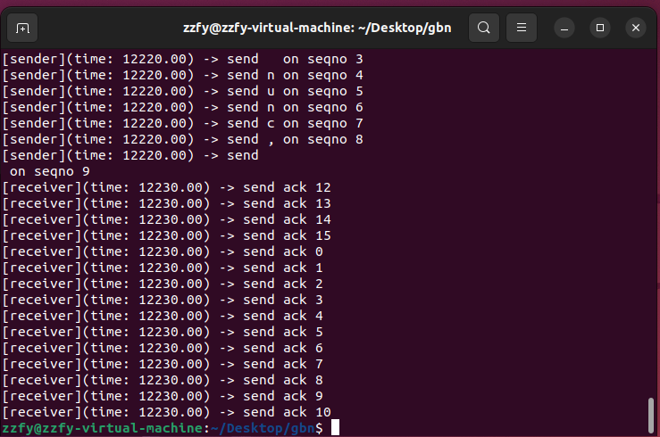

# GBN Sender Lab Report
<center> 姓名：张郑飞扬  学号：PB21071416  日期：2023.12.27</center>

## 实验目的

Go-Back-N是自动重复请求(ARQ)协议的一个特定实例，在该协议中，即使没有收到来自接收方的确认(ACK)包，发送过程也会继续发送由窗口大小指定的分组数。它是一般滑动窗口协议的一种特殊情况，发送窗口大小为N，接收窗口大小为1。当收到接收方的确认时，发送方将窗口向后移动，并且发送其他可以发送的分组。

在这个实验中，你的任务是实现一个搭建在OpenNetLab上的使用GBN协议的发送端。

## 代码布局

```
dns
|
|--main.py          本地调试运行文件
|--receiver.py      接收方文件，无需修改
|--sender.py        发送方文件， TODO 部分需要编写
|--testcases.json   本地评测配置文件
|--tester           本地评测运行文件
```

## 实验要求
在这个实验中，你需要将一个字符串中的每个字符封装为分组发送给接收方，并且遵循GBN协议：

- 开始时发送滑动窗口内所有可以发送的分组。
- 每发送一个分组，保存该分组在缓冲区中，表示已发送但还未被确认。
- 缓冲区使用一个定时器，当定时器超时的时候，重新发送缓冲区中的所有分组。
- 当收到接收方的确认后，判断该确认是否有效。如果无效的话，什么也不做；如果有效的话，采取累计确认，移动滑动窗口，将已经被确认的分组从缓冲区中删除，并且发送接下来可以发送的分组，重置定时器。

该实验 TODO 部分的伪代码如下：

```
function run() {
    # send available packets, add these packets to buffer
    while (sequence number is available) {
        encapsulate messages into new packets
        send new packets
        add these packets to buffer
    }
    reset timer
    Check whether to terminate the sending process
}

function put(packet) {
    # Process packets received from the receiver
    if ackno is valid {
        remove acked packets from the buffer
    }
    send the following available packets
    if all packets are sent and acked {
        Inform to terminate the sending process
    }
}

function timeout_callback() {
    for all packets in the buffer {
        send packet
    }
}
```

## TODO部分代码展示及解释

* run  函数

    ```Python
    def run(self, env: Environment):
        while (((self.seqno - self.seqno_start + self.seqno_range) % self.seqno_range < self.window_size) and self.absno < len(self.message)) :
            data = self.message[self.absno]
            packet = self.new_packet(self.seqno, data)
            self.send_packet(packet)
            self.outbound.append(packet)
            self.absno += 1
            self.seqno = (self.seqno + 1) % self.seqno_range
    
        self.timer.restart(self.timeout)
    
        yield self.finish_channel.get()
    ```

    解释：  

    该方法严格按照伪代码实现。

    while 语句的循环条件为：seqno在窗口之内，且 absno 小于 message的长度（即窗口里有待发送的数据包，且字符串没有被发完）。

    若满足条件，则将下一个字符打包发送，并放入缓冲区中，表示已发送但未被确认，并且 seqno 和 absno 都递增（注意 seqno 需要取模，因为是循环序号)。

    循环结束后，窗口里所有的包都被发送出去，缓冲区被填满，设置定时器。

    最后通过`self.finish_channel.get()`获取状态，即当`self.finish_channel.put(True)`时发送端模拟结束

* put  函数
	```python
  def put(self, packet: Packet):
  	ackno = packet.packet_id
  
    	if ((ackno - self.seqno_start + self.seqno_range) % self.seqno_range < self.window_size):
     		for _ in range((ackno - self.seqno_start + 1 + self.seqno_range) % self.seqno_range):
    			self.outbound.popleft()
        
    		self.seqno_start = (ackno + 1) % self.seqno_range
  
  		while (((self.seqno - self.seqno_start + self.seqno_range) % self.seqno_range < self.window_size) and self.absno < len(self.message)) :
    			data = self.message[self.absno]
    			packet = self.new_packet(self.seqno, data)
    			self.send_packet(packet)
     			self.outbound.append(packet)
    			self.absno += 1
     			self.seqno = (self.seqno + 1) % self.seqno_range

      	self.timer.restart(self.timeout)
  
      if(self.absno == len(self.message) and len(self.outbound) == 0):
          self.finish_channel.put(True)
  
  ```
  
	解释：

	该方法严格按照伪代码实现。

	首先判断接收到的 ACK 是否有效：即 ackno 需要在窗口所包含的序号内。

	若有效，因为采取累计确认，所以窗口需要滑动到 ackno 的下一位。并把已经确认的数据包移出缓冲区。
	
	然后开始发送滑动后的窗口内，待发送的数据包，并把发送的数据包移入缓冲区（这部分代码和run里面while循环是一样的）。
	
	窗口里待发送的包全部被发送完之后，需要重置计时器。
	
	最后检查是否发送完message，即检查absno是否等于message长度，并且缓冲区是否被清空，如果两个条件都满足，那么代表message已经发送完毕，并且被接收端接收完毕，则告知结束: ``self.finish_channel.put(True)``

* timeout_callback 函数
	
	```python
  def timeout_callback(self):
  	self.dprint("timeout")
      
  	for packet in self.outbound:
            self.send_packet(packet)
  ```
  
  该方法严格按照伪代码实现。
  
  如果计时器超时，那么直接重发缓冲区内的所有包，并且重置计时器。
  
  由于根据提醒，这个函数结束会自动重置定时器，故不用手动重置，只需在函数中实现重发缓冲区内的所有包
  
## main.py 在本地执行的结果

可以看到测试字符串被正确发送完毕，最后结束时并未报错``AssertionError: Error``



## tester程序在本地执行的输出结果

所有测试用例均在本地 Linux 虚拟机上通过：


## 代码在 OpenNetLab 上的最终评估结果

所有测试用例均在 OpenNetLab 上通过：

