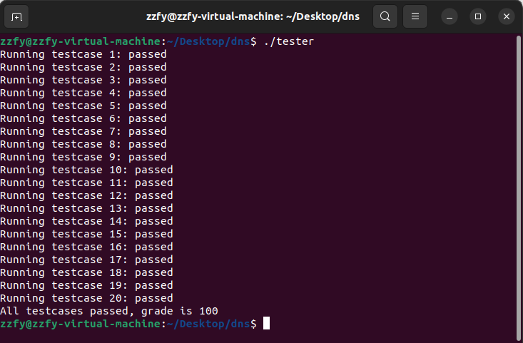
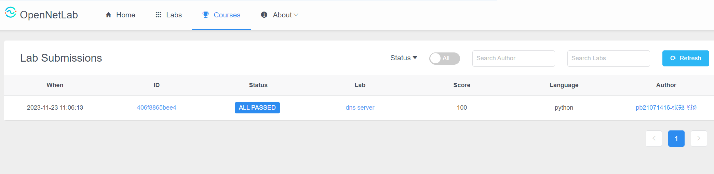

# DNS_server Report
<center> 姓名：张郑飞扬  学号：PB21071416  日期：2023.11.23</center>

## 实验目的

DNS（Domain Name System）是互联网中用于将域名（例如www.example.com）转换为对应IP地址的系统。在互联网上，设备之间通信需要使用IP地址进行定位，但IP地址不便于人们记忆和使用。DNS充当了一个类似电话簿的角色，将易于记忆的域名映射到相应的IP地址，从而使得用户可以通过域名来访问网站或者发送电子邮件，而无需记住复杂的IP地址。当用户在浏览器中输入一个域名时，系统会通过DNS查询将域名解析为对应的IP地址，然后进行通信。DNS起到了极为重要的转换和定位功能，是互联网通信的基础。

在这个实验中，你的任务是实现一个搭建在OpenNetLab上的DNS服务器，该服务器具备拦截特定域名，以及返回域名对应IP的功能。

## 代码布局

```
dns
|
|--main.py          本地调试运行文件
|--ipconf.txt       本地调试配置文件
|--client.py        客户端文件
|--server.py        服务器文件,本实验需要完成该文件中的TODO部分
|--dns_packet.py    DNS数据包解析和编码文件
|--testcases.json   本地评测配置文件
|--tester           本地评测运行文件
```

## 实验要求
在这个实验中，服务器从配置文件 ``ipconf.txt`` 中读取 ``domain name --- IP address`` 的映射。你需要按照如下规则处理DNS请求：

Intercept：如果请求的DNS域名在配置文件的映射中并且对应的IP为 ``0.0.0.0`` ，对该域名进行拦截，向客户端返回“域名不存在”的报错信息。

Local Resolve：如果请求的DNS域名在配置文件的映射中并且对应的IP是合法的，返回对应IP地址给客户端。

Relay：如果请求的DNS域名不在配置文件，将对应的DNS请求转发给公网上的DNS服务器，当收到该服务器的应答时，将应答转发给客户端。

该实验 TODO 部分的伪代码如下：

```
function recv_callback(data){
    # process DNS requests
    resolve data to DNS frame recvdp
    if recvdp is a query message{
        if recvdp.qname is in url_ip table{
            if url_ip[recvdp.qname]="0.0.0.0"{
                generate a reply error data
            }
            else{
                generate response data
            }
        }
        else{
            send query message to public DNS server
            receive data from public server
        }
        send data to client
    }
}
```

## TODO部分代码展示及解释

代码展示：
```Python
def recv_callback(self, data: bytes):
    # 解析data得到构建应答数据包所需要的字段
    recvdp = DNSPacket(data)
    domain_name = recvdp.name
    recvdp_is_query = not(recvdp.QR) 
    # 根据请求中的domain name进行相应的处理
    if recvdp_is_query:
        if domain_name in self.url_ip:
                ip = self.url_ip[domain_name]
                if ip == '0.0.0.0':
                    response = recvdp.generate_response(ip,True)
                else:
                    response = recvdp.generate_response(ip,False)
        else:
        self.server_socket.sendto(data,self.name_server)
        response, _ = self.server_socket.recvfrom(4096)
        self.send(response)
```

解释：  

该方法定义在 ``DNSServer`` 类中，用于接受来自客户端的字节形式的DNS请求报文 ``data``，对其解码，并处理DNS请求，传回应答报文。下面逐行解释该方法的代码：

```python
recvdp = DNSPacket(data) 
domain_name = recvdp.name
recvdp_is_query = not(recvdp.QR)   
```

>通过``DNSPacket``类解析传入的DNS报文（``DNSPacket``类被定义在``dns_packet.py``文件中）。  
从解析后的  DNSPacket 对象中获取域名，保存在变量``domain_name``中。  
通过查看 DNS 请求/响应标志位（QR），判断接收到的数据包是一个查询还是一个响应。如果 QR 为 False，表示这是一个查询。

```python
if recvdp_is_query:
    if domain_name in self.url_ip:
            ip = self.url_ip[domain_name]
            if ip == '0.0.0.0':
                response = recvdp.generate_response(ip,True)
            else:
                response = recvdp.generate_response(ip,False)
    else:
    self.server_socket.sendto(data,self.name_server)
    response, _ = self.server_socket.recvfrom(4096)
    self.send(response)
```

>这一段将上述伪代码具体化：
>>如果是查询 (recvdp_is_query) ，则：  
>>>如果请求的域名在 self.url_ip 中，则会检查对应的 IP 地址。如果查询的域名ip地址为 `0.0.0.0`，则在调用``generate_response`` 方法时，对intercepted参数传入True，从而构造报错的应答数据包。否则传入False，构造含ip地址的正确的应答数据包。  
如果查询的域名不在 self.url_ip 中，那么它会将请求转发给指定的 DNS 服务器 (``self.server_socket.sendto(data, self.name_server)``)，然后等待响应 (``response, _ = self.server_socket.recvfrom(4096)``)。  
>>>
>>最后传回应答报文 (``self.send(response)``)

## tester程序在本地执行的输出结果

所有测试用例均在本地Linux虚拟机上通过：



## 代码在OpenNetLab上的最终评估结果

所有测试用例均在OpenNetLab上通过：



